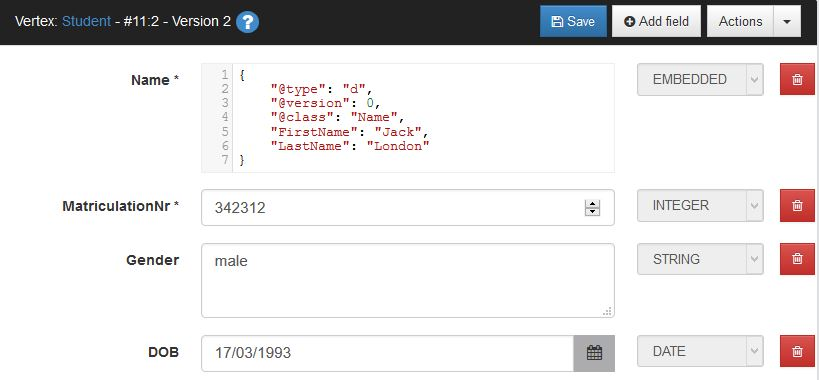

# Database Schema
## Learning Objectives
In this chapter of the tutorial you will learn ...
* the difference of shema-full, schema-less and schema-hybrid mode of the OrientDB graph database
* how to create a new OrientDB graph database using OrientDB Console
* how to create a graph database schema
* how to insert some data into the database using the OrientDB Studio web application


##Schema-Full, Schema-Less and Schema-Hybrid Mode
OrientDB can be used to store [graph databases](http://en.wikipedia.org/wiki/Graph_database). A graph database consists of **vertices** or **nodes** and **edges** which connect the vertices. Small graphs can easily be represented graphically using circles or squares for the vertices and lines for the edges.


Figure 2: Visual representation of a graph

Vertices and edges store information in properties. E.g. you may want to create a vertex to store a person with a Name, an E-Mail and a Telephone property.

With OrientDB it is possible to work in a **schema-less mode**. In this mode there are only two types of records in your database: vertices stored in class V and edges stored in class E. Each vertex may have different properties. The schemaless mode is very good if the objects differ widely in their properties or if your schema is changing quickly.

However the schema-less mode is not the best choice if different users access the database. One user might call a property "color" the next one "colour". OrientDB cannot identify both properties being identical. To avoid this error it is better to work in **schema-full mode** where the properties of different vertex classes are predefined.

OrientDB offers a third mode, the **schema-hybrid** or **schema-mixed mode**, where some properties are fixed and other ones can be freely defined by the users. Read more about the different modes in the [OrientDB dcumentation](http://orientdb.com/docs/last/orientdb.wiki/Graph-Schema.html).

In this tutorial we will use the schema-full mode to avoid errors especially when different applications access the database.

## Create a new Database using the OrientDB Console
OrientDB offers several possibilities to create new databases:
* Use **Studio** to [create a new database interactively](http://orientdb.com/docs/last/Studio-Home-page.html#create-a-new-database)
* Use **Console** and the [create database command](http://orientdb.com/docs/last/Console-Command-Create-Database.html)
* Use the **Java API** to create a database with a Java program.

In this tutorial we will use the Console with a script file.

If you prefer to watch a screencast video click on the video start page.

<a href="EclipseRobotWorldModel.mp4
" target="_blank"></a>

You can start the OrientDB Console application and then enter one console command after the other interactively. However we will use the batch mode of Console.

* Create an empty text file *CreateDB.txt* and open it with your favorite editor.
* Enter OrientDB commands line by line (see below). Close each command by a semicolon ";".
* Save *CreateDB.txt*
* Open a command window or shell
* Go to the bin directory of your OrientDB installation, e.g. ```cd /orientdb/bin```
* Start OrientDB Console with the command file:  
```console.bat <path to command file>/CreateDB.txt``` on Windows or  
```console.sh <path to command file>/CreateDB.txt``` on Linux
* Enter the console command ```info```. You get an overview of the just created database with all created classes.
* Type ```exit``` to close OrientDB Console.

Which are the commands you enter in the command file *CreateDB.txt*?

First switch on Echo mode. This will show you the executed commands during the batch run:  
```set echo true;```

Then create the new database locally (plocal) on your computer. The key-word ```plocal``` is followed by the path to the database directory of your OrientDB installation and the name of the database:  
```create database plocal:/orientdb/databases/CourseParticipation;```

## Create the Classes of the Database Schema

You are automatically connected to the newly created database. So you can go on and create some classes in it:  
```sql
create class Student extends V;
create class Course extends V;
create class attends extends E;
create class requires extends E;
```

CourseParticipation was created as graph database. OrientDB creates two default classes for a graph database: **V** for vertices and **E** for edges. Objects like students or courses are usually stored as vertices. Hence *Student* and *Course* are created as subclasses of *V*. Relationships are usually stored as edges. Hence the relations *attends* and *requires* are created as subclasses of *E*.

Students have a name. This name is not a single value but structured. It consists of a first name, a last name, perhaps a title etc. Instead of creating separate fields for all these attributes as we would have to do in a relational table, in OrientDB we can connect these fields more tightly in an extra class. Since Names are not standalone objects but belong to students the Name objects will not be stored as vertices in the graph. They will be embedded in the Student objects. Hence the Name class is created as a pure document class.
```sql
create class Name;
```
In schema-less mode we could begin to store objects in the classes. However we want to work with a schema. Hence we create the properties of the classes:
```
create property Name.FirstName string;
create property Name.SecondName string;
create property Name.LastName string;
create property Name.Title string;
```
An empty name doesn't make sense. A *mandatory* and a *not-null* constraint enforce that at least the last name is set. *MANDATORY* ensures that every record has this field and *NOTNULL* guarantees that this field has a value. Use ```ALTER PROPERTY``` to set the constraints.
```
alter property Name.LastName mandatory true;
alter property Name.LastName notnull true;
```

Now you can create the properties of the Student class:
```
create property Student.Name embedded Name;
alter property Student.Name mandatory true;
alter property Student.Name notnull true;
create property Student.DOB date;  // Date of birth
create property Student.Gender string;
alter property Student.Gender regexp [male|female];
create property Student.StudentNr integer;
alter property Student.StudentNr mandatory true;
alter property Student.StudentNr min 1000;
create sequence StudNrSeq starts with 1000;
```

* The student's name is embedded and must not be empty.
* For gender only the values "male" and "female" are allowed. This is guaranteed by a regular expression constraint.
* The student number is a mandatory field for Student. The numbers must have at least four digits.
* Of course student numbers must be unique. This is guaranteed by a **unique index**.  Indexes also speed up search operations. Find more information about [indexes in the OrientDB documentation](orientdocu).
* Unique student numbers can easily be created using **sequences**. StudNrSeq.next() creates a new number. Find more information about [sequences in the OrientDB documentation](orientdoku)

In the same way create the properties for the Course class:
```
create property Course.Subject string;
alter property Course.Subject mandatory true;
alter property Course.Subject notnull true;
create property Course.CourseNr integer;
alter property Course.Coursenr mandatory true;
alter property Course.Coursenr notnull true;
alter property Course.Coursenr min 10000;
alter property Course.Coursenr max 99999;
create property Course.Description string;
create property Course.LearningObjectives embeddedlist string;
create property Course.CreditPoints short;
alter property Course.CreditPoints min 1;
```

In contrast to relational databases OrientDB supports multivalued fields. For the property *LearningObjectives* we use an embedded list of strings.

Finally create properties for the edge class *attends*. Here the grades of students in the different courses are stored.
```
create property attends.Semester integer;
create property attends.Attempt short;
create property attends.Grade string;
```

Save your command file and execute it:  
```console.bat <path-to-command-file>/CreateDB.txt``` on Windows or  
```console.sh <path-to-command-file>/CreateDB.txt``` on Linux.

Be sure that the OrientDB server is not running when you execute the console script since you create the new database locally on your computer. 

If you like, you can download the complete file with the Console commands to create the database schema: [CreateDB.txt](CreateDB.txt).

## Insert some Sample Data into the Database
To insert data into the database there are again three possibilities:
* Use **Studio** to create a new vertex interactively or with SQL
* Use **Console** and SQL: [create vertex](http://orientdb.com/docs/last/SQL-Create-Vertex.html) and [create edge](http://orientdb.com/docs/last/SQL-Create-Edge.html)
* Use the **Java API** to create a vertex using the Java API.

### Create Vertices and Edges with Studio
Open a command prompt  (command shell) window on the computer where you want to start the OrientDB server.

Change to the bin directory of your OrientDB installation, e.g. ```cd /orientdb/bin```


Call ```server.bat``` on MS-Windows or ```server.sh``` on Unix to start the OrientDB server.


Start an internet browser like Firefox on your client computer (may be the same computer).

Open the URL ```http://localhost:2480/studio/index.html#/```. Replace "localhost" by the link to your server if you run client and server on different computers.

Select the Database "CourseParticipation" you have created before and type "admin" as User and Passwort. Click on "Connect".


Click on "Schema" in the menu bar.

Look for the class "Student" in the list of classes. Click on "Add record" at the end of this row.

Type the data of a new Student. The Name being an embedded document must be entered in JSON format: ```{'@type':'d', '@class':'Name', 'FirstName':'John', 'LastName':'Baker'}```. Finally click on "Save".

