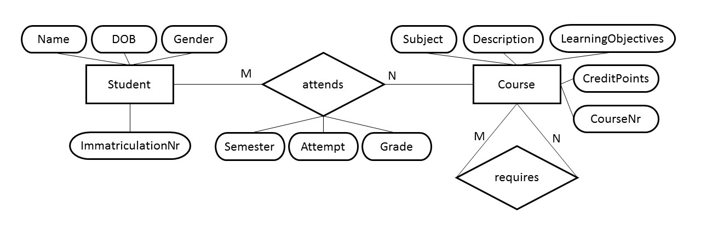

# Sample Application
##Students of a University Attend Courses
Regard a **university**. Of course the university stores information about **Students** in a database: name, date of birth, gender, ... . The university offers **Courses** of which information is also stored in the database: subject, description, credit points, learning objectives, ... .

We consider also two relations:
* The students **attend** courses and get grades in exams.
* Courses are based on other courses: To attend a course the knowledge achieved in another course may be **required**.

Figure 1: Entity Relationship Diagram for Students and Courses

